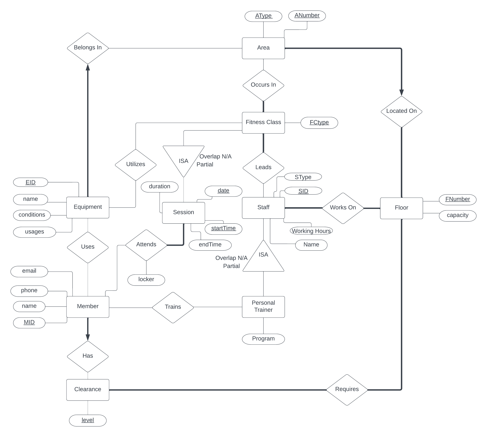

# FitnessLab

This is FitnessLab, a Gym Management Software project I built with two other students for a Databases Course.

## Key Features:

- ER Diagram: I designed an ER diagram with nine entities, 11 relationships, and 2 ISA hierarchies. This enables efficiency and eliminates data redundancy.
- Backend: I used JDBC/Oracle to implement our Database backend, with a SQL Plus script for quick setup. Dynamic SQL queries and robust error handling are built into the system as well.
- Frontend: We used the Java Swing framework for the frontend, creating an intuitive interface connecting users to their data.

## Skills:
- Java
- SQL Plus
- Oracle DB
- JDBC
- Swing
- ER Diagrams
- Normalization
- BCNF
